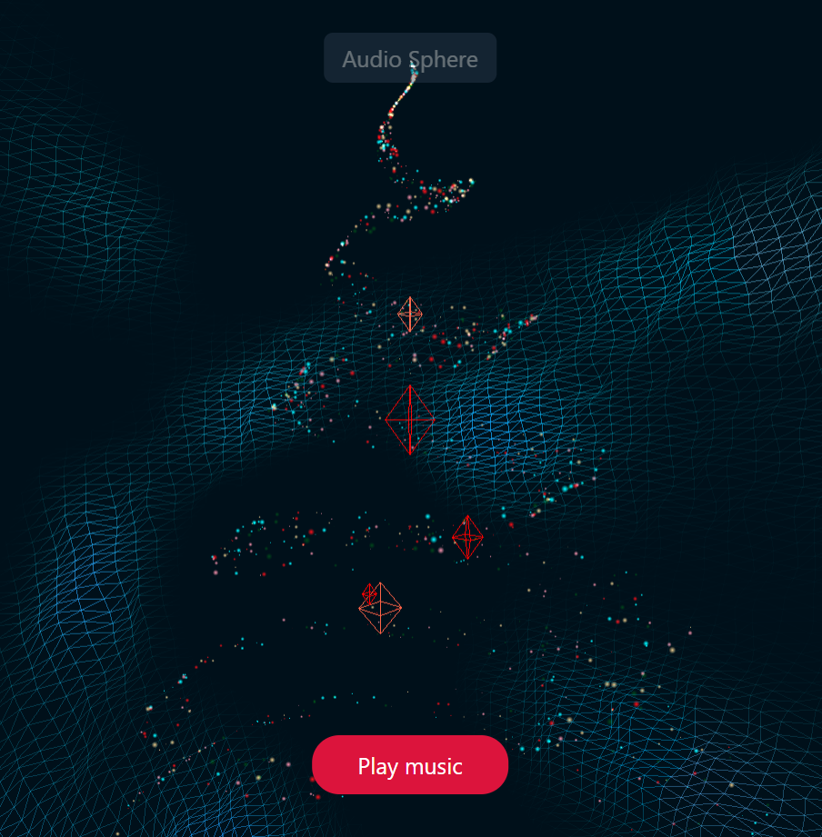
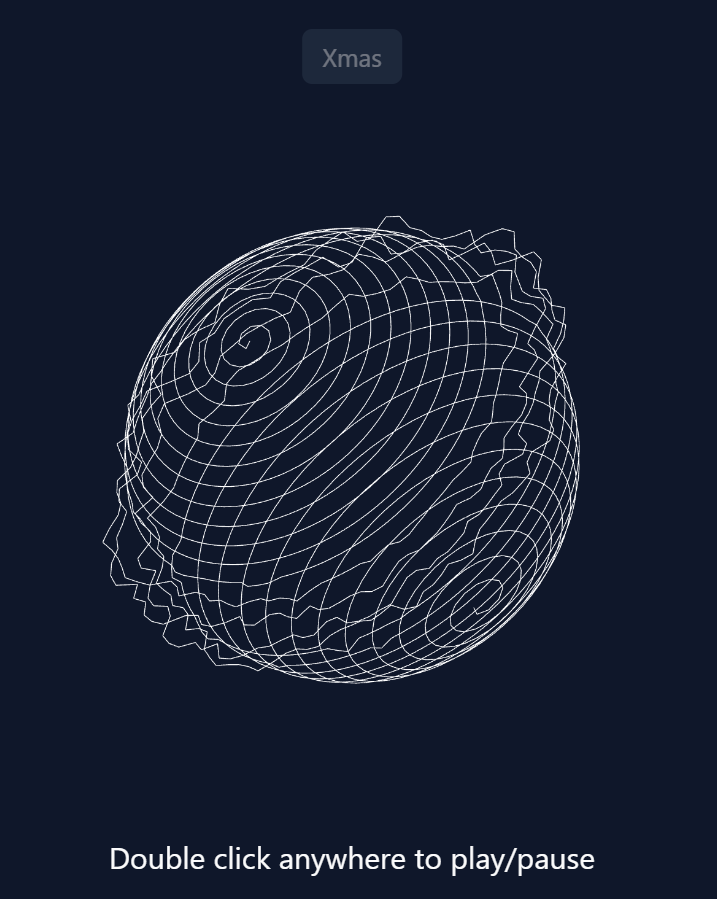

<h1 align="center">Audio Reactive Visual</h1>
<p align="center">  
  
</p>
<div align="center"><a href="https://yuran1811.github.io/audio-reactive-visual/" target="_blank">Live Demo</a></div>

## Introduction

- This project is a simple audio reactive visual using `threejs`, `gsap` and `web audio api`.

## Tech Stack


## Screenshots

<div style="display:flex;gap:12px;justify-content:center">
    
    
</div>

## Quick Start

Follow these steps to set up the project locally on your machine.

**Prerequisites**

Make sure you have the following installed on your machine:

- [Git](https://git-scm.com/)
- [Node.js](https://nodejs.org/en)
- [npm](https://www.npmjs.com/) (Node Package Manager)

**Cloning the Repository**

```bash
git clone https://github.com/yuran1811/audio-reactive-visual.git
cd audio-reactive-visual
```

**Installation**

Install the project dependencies:

```bash
npm install
```

or

```bash
yarn
```

**Running the Project**

```bash
npm run dev
```

or

```bash
yarn dev
```

Open [http://localhost:5173](http://localhost:5173) in your browser to view the project.

## References

- [XMas Tree by thuongton999](https://codepen.io/thuongton999/pen/VwRYaRw) inspired from [ThreeJS Audio Reactive Visual](https://github.com/kekkorider/threejs-audio-reactive-visual/tree/main) with some modifications and improvements by [me](https://github.com/yuran1811).
